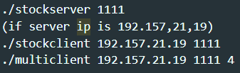

 
developer : Han Chan Hee 
student id : 20182204 
date : 2021-06-22 ~ 2021-06-24 
 

> Shell command must be lowercase! 
> 2 projects are in the 20182204/ folder  
> project1 : event - based stock server 
> project2 : thread based stock server 
 
 

**Compile** 
    enter (make) to compile 
  

**Run** 
    server run : ./stockserver `<port number>` 
    client run : ./stockclient `<server ip>` `<port number>` 
    multiclient run : ./multiclient `<server ip>` `<port number>` `<user number>`  
 

** example **

  

**delete** 
    enter (make clean) 
    it removes all execute files 
  

**command** 
    - show : show all the items in stock server 
    - buy (stock id) (stock num) : buy stock if there is not enough stock then msg is resented. stock price is not changed 
    - sell (stock id) (stock num) : sell stock 
    - exit : exit the program 